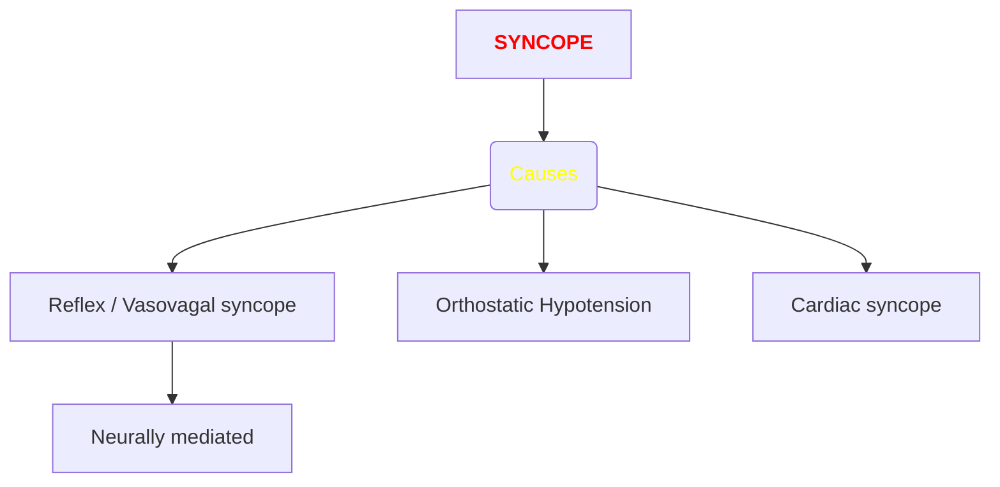
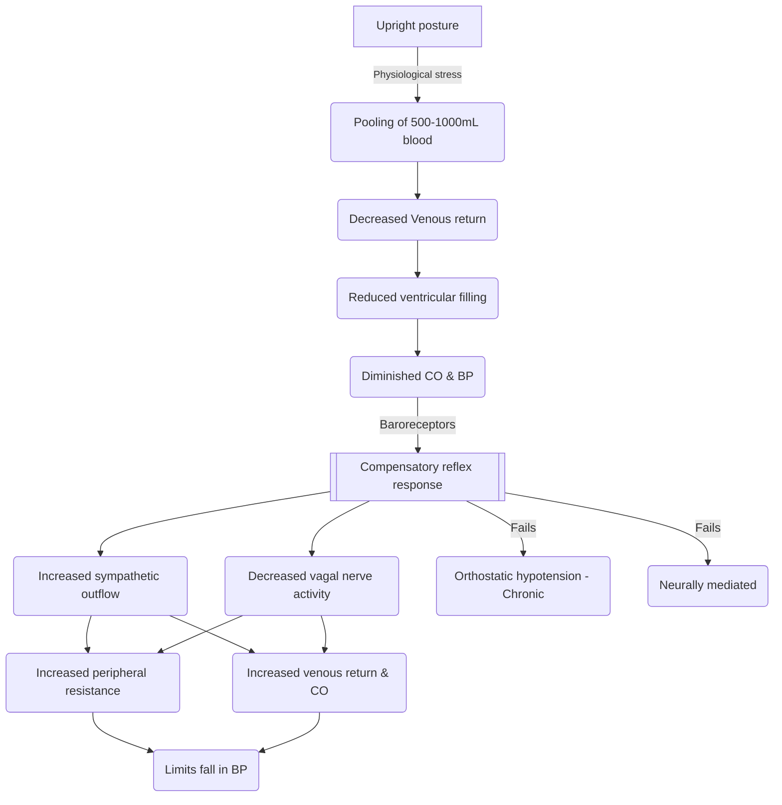

#SYNCOPE #Physiology

- Transient
- Self limited 
- Loss of consciousness
#### Due to  impaired blood flow  🩸

* Rapid onset
- DD for transient loss of consciousness
	→ Seizures
	→ Vertebrobasilar ischemia
	→ Hypoxemia
	→ Hypoglycemia

- Symptoms
	- *Light-headedness / faintness*
	- *Dizziness*
	- *Weakness*
	- *Fatigue*
	- *Visual & auditory disturbances*

### 1) Neurally mediated (Reflex / Vasovagal) ==MC cause==

- Transient change in the reflexes responsible for maintaining cardiovascular homeostasis
	- Episodic vasodilation
	- Decreased Cardiac output
	- Bradycardia

### 2) Orthostatic hypotension
-  Due to autonomic failure
- Cardiovascular homeostatic reflexes are chronically impaired

### 3) Cardiac syncope
- Due to Arrhythmias / Structural cardiac diseases
- --> Decreased cardiac output

#### Epidemiology 

- Peak Incidence --> ==**10** to **30**== years | > After 70 years of age
- Women > Men

#### Pathophysiology 

