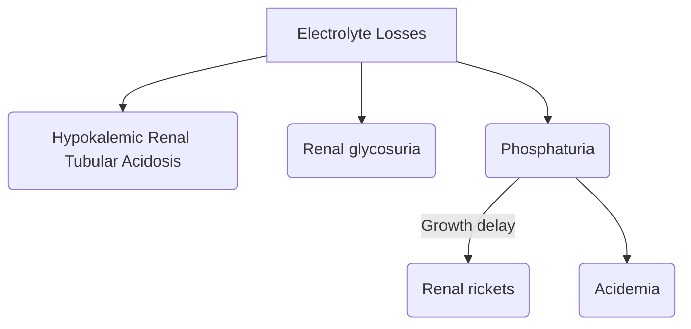
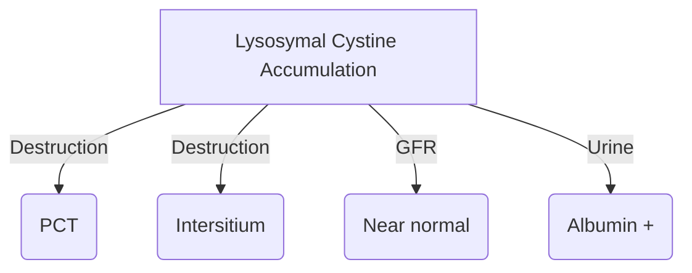
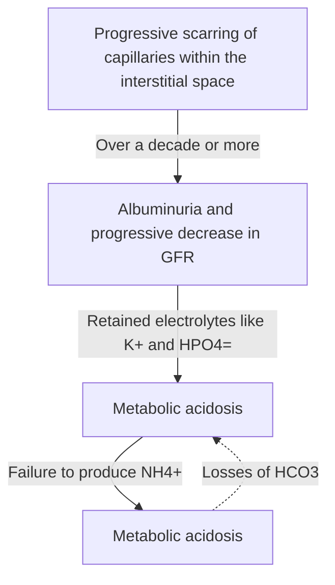

#Pediatrics #Fanconi 
##### One of the [[Lysosomal storage diseases]]

Progression of disease:
	1. 1st year of life :
		- Child easily dehydrated from salt-water wasting
		- Feed & grow poorly
		- Polyuria
		- Hypotension
		- Muscle weakness
		  + Features of Proximal tubular dysfunction
	

2. After few decades:

